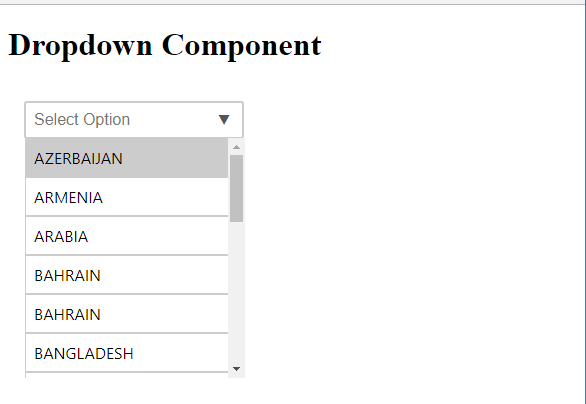
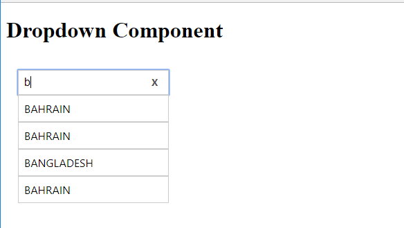
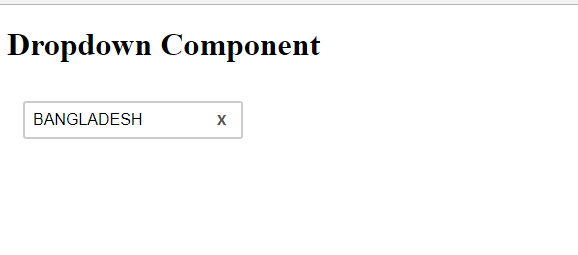

# Autocomplete Dropdown List Using Angular4


<p align="center">
    
</p>

To preview demo of auto complete dropdown list project, [Click here](https://angular-efbhlg.stackblitz.io/)


## Using the complete project

Download the auto-complete-dropdown-list folder and install the required packages and run the application. 

### Installing

```
> npm install
```

### Run server

```
> ng serve
```


### Adding auto-complete-dropdown-list component in your project
 Download the auto-complete-dropdown-list component to your project.  
 
**<app-dropdown [dropdownOptions]='countryList'></app-dropdown>**

###Interface

export interface CountryInfo {
  label:string;
  value:string;
}
  
#### Initially the component looks like this:

<p align="center">
    
</p>

#### when user enters something to search in the Search box,it will automatically give some suggestions(Because of autocomplete):

<p align="center">
    
</p>

#### When user clicks the selected value, the value will be appended to the input text box:

<p align="center">
    
</p>

